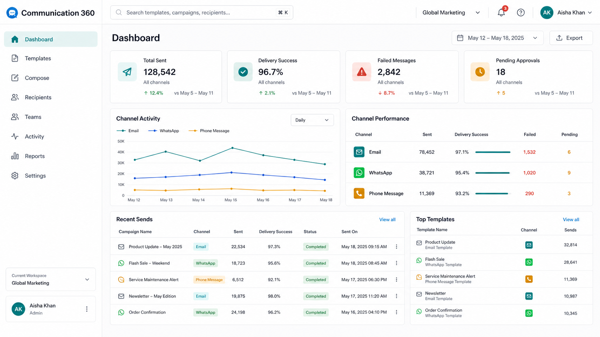
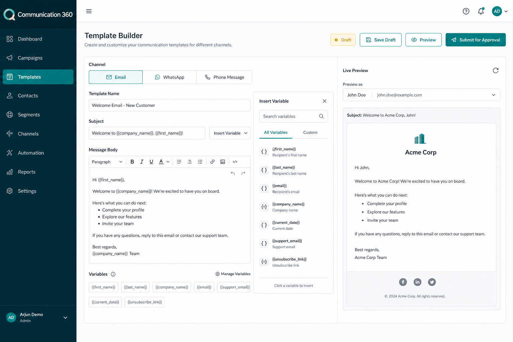

# Communication 360

Communication 360 is a single communication platform for creating templates, selecting recipients, sending messages, and tracking delivery across Email, WhatsApp, and Phone Message channels.

The product brings business communication into one controlled workspace. Teams create reusable templates, send messages to external email addresses, communicate with Communication 360 users, target complete teams, and monitor communication activity from a central dashboard.

## What Communication 360 Does

Communication 360 manages the full communication lifecycle:

- Creates reusable templates for Email, WhatsApp, and Phone Message communication
- Stores templates in a centralized library with versioning and approval status
- Sends emails to manually entered email addresses
- Sends emails to users already available inside Communication 360
- Sends communication to teams by selecting one or more team groups
- Resolves users and teams into a final recipient list before sending
- Removes duplicate recipients from group sends
- Validates invalid or incomplete recipient records
- Previews messages before delivery
- Sends communication immediately or through scheduled delivery
- Tracks sent, delivered, failed, pending, and provider-rejected messages
- Maintains audit history for templates, sends, and administrative changes

Communication 360 is built for organizations that need reliable, secure, and repeatable communication across multiple channels without switching between disconnected tools.

## Product Screens

### Dashboard

The dashboard gives teams a live operating view of communication activity across all channels.

### Template Builder

The template builder gives users one place to create channel-specific templates, manage variables, preview content, and submit templates for approval.

### Compose and Recipients

The compose screen combines template selection, direct email entry, Communication 360 user selection, team targeting, recipient validation, preview, and final send review.

## Core Capabilities

### Multi-Channel Template Management

Communication 360 supports template creation for:

- Email
- WhatsApp
- Phone Message

Each template contains channel-specific content, variables, metadata, status, and ownership information. Templates move through draft, review, approved, archived, or rejected states.

### Email Communication

Email communication supports direct and internal recipient targeting.

Users can:

- Enter one or more external email addresses
- Search and select Communication 360 users
- Select one or more teams
- Combine external addresses, users, and teams in one send
- Preview resolved template variables before sending
- Track each recipient's delivery status

### WhatsApp Communication

WhatsApp communication uses structured templates that align with provider requirements.

The platform manages:

- Template body
- Header content
- Variables
- Language metadata
- Category metadata
- Provider approval state
- Delivery status updates

### Phone Message Communication

Phone Message communication supports short-form messaging through connected phone or SMS providers.

The platform manages:

- Message body
- Recipient phone numbers
- Variables
- Sender identifier
- Provider response status
- Delivery tracking

### Users and Teams

Communication 360 includes a recipient model for internal users and teams.

Users represent individual people with email and phone contact details. Teams group users for fast, consistent communication to departments, project groups, support teams, sales units, operations groups, or any internal audience.

When a sender chooses a team, Communication 360 expands the team into its active members, validates recipients, removes duplicates, and presents a final summary before sending.

### Recipient Validation

Before delivery, Communication 360 validates the recipient list and displays:

- Total recipients
- External email addresses
- Selected users
- Selected teams
- Duplicate recipients removed
- Invalid recipients
- Missing contact information

This validation step reduces accidental sends and improves delivery quality.

### Preview and Send Review

Every send flow includes a final review screen with:

- Selected channel
- Template name
- Sender identity
- Recipient count
- Resolved message preview
- Variable validation
- Delivery timing
- Confirmation action

High-volume sends use a deliberate confirmation step before messages enter the delivery queue.

## UI Design

Communication 360 uses a clean, production-grade interface built for repeated operational use. The design focuses on speed, clarity, and confidence during template creation and message sending.

### Navigation

The application uses a left sidebar for primary navigation:

- Dashboard
- Templates
- Compose
- Recipients
- Teams
- Activity
- Reports
- Settings

The top bar contains workspace selection, global search, notifications, and the user profile menu.

### Dashboard Experience

The dashboard presents communication health in a compact operational layout:

- Total messages sent
- Delivery success rate
- Failed communications
- Pending approvals
- Channel-wise activity
- Recent sends
- Top-used templates

Channel activity is grouped by Email, WhatsApp, and Phone Message, allowing teams to compare volume and delivery performance quickly.

### Template Builder Experience

The template builder uses a split layout:

- Left and center area for template content
- Channel selector for Email, WhatsApp, and Phone Message
- Structured fields for template metadata
- Message editor for template body
- Variable manager for dynamic placeholders
- Right panel for live preview
- Status badge for draft, review, approved, rejected, or archived state

This layout keeps content creation and preview visible at the same time.

### Compose Experience

The compose flow uses clear steps:

1. Select channel
2. Select template
3. Choose recipients
4. Review message
5. Send or schedule

Recipient selection is separated into tabs for Email Addresses, Users, and Teams. The send summary remains visible so users always know who receives the message.

### Visual Language

The UI uses:

- Neutral application background
- White work surfaces
- Strong contrast for readable text
- Teal primary actions
- Blue selected states
- Amber review or pending states
- Red validation and failure states
- Compact tables for activity and reports
- Badges for template and delivery status
- Icons for channels, users, teams, reports, settings, and send actions

The interface is intentionally work-focused and avoids decorative layouts that distract from communication tasks.

### Accessibility

Communication 360 supports accessible, professional workflows through:

- Keyboard-friendly forms
- Visible labels for inputs
- Clear focus states
- Status text paired with color indicators
- Field-level error messages
- Confirmation dialogs for high-impact sends
- Readable contrast across tables, badges, and forms

## Main Workflows

### Create a Template

1. Open Templates.
2. Create a new template.
3. Select Email, WhatsApp, or Phone Message.
4. Add template name, content, variables, and metadata.
5. Preview the rendered message.
6. Save as draft or submit for approval.

### Send Email to External Addresses

1. Open Compose.
2. Select Email as the channel.
3. Choose an approved email template.
4. Add one or more email addresses.
5. Review validation results.
6. Preview the final message.
7. Confirm and send.

### Send Email to Communication 360 Users

1. Open Compose.
2. Select Email as the channel.
3. Choose an approved template.
4. Open the Users tab in the recipient selector.
5. Search and select users.
6. Review the recipient summary.
7. Confirm and send.

### Send Communication to Teams

1. Open Compose.
2. Select the channel.
3. Choose an approved template.
4. Open the Teams tab.
5. Select one or more teams.
6. Communication 360 resolves active team members.
7. Review duplicates, invalid recipients, and final count.
8. Confirm and send.

## Roles and Permissions

| Role | Responsibilities |
| --- | --- |
| Administrator | Manages users, teams, providers, settings, and permissions |
| Manager | Reviews templates, approves communication, and monitors activity |
| Template Creator | Creates and edits templates for supported channels |
| Sender | Sends approved communication to allowed recipients |
| Viewer | Views templates, activity, and reports |

## Configuration

Communication 360 is configured through environment variables and secure provider settings.

Common configuration areas:

- Application host and port
- Database connection
- Cache and queue connection
- Email provider credentials
- WhatsApp provider credentials
- Phone Message provider credentials
- Authentication settings
- Encryption keys
- File storage settings
- Logging and monitoring settings

Secrets are stored outside source control and managed through secure environment configuration or a secrets manager.

## Deployment

Production deployment includes:

- HTTPS-enabled application access
- Secure environment configuration
- Database migrations
- Background workers
- Scheduled job processing
- Queue-based delivery
- Encrypted provider credentials
- Logging and monitoring
- Backup and recovery process
- Provider quota and rate-limit monitoring

## Security

Communication 360 protects communication workflows through:

- Role-based access control
- Strong authentication
- Secure provider credential storage
- Audit logs for template, send, team, and permission changes
- Recipient input validation
- Template approval workflow
- Confirmation before high-volume sends
- Least-privilege access for users and services

## Reporting

Communication 360 reporting gives teams visibility into communication performance.

Available reporting areas:

- Messages sent by channel
- Delivery success rate
- Failed messages
- Pending messages
- Provider rejections
- Template usage
- User and team activity
- Communication history
- Audit history

## Support

For product support, contact the Communication 360 maintainers or the internal platform team.

## License

Add the project license here.

Use the appropriate commercial, private, or internal license terms for the deployment.
